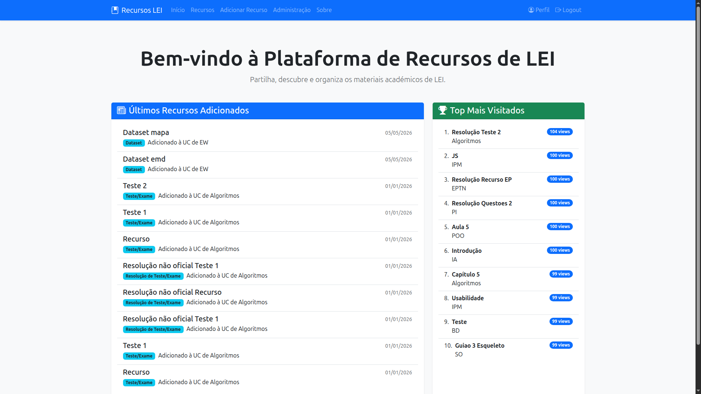
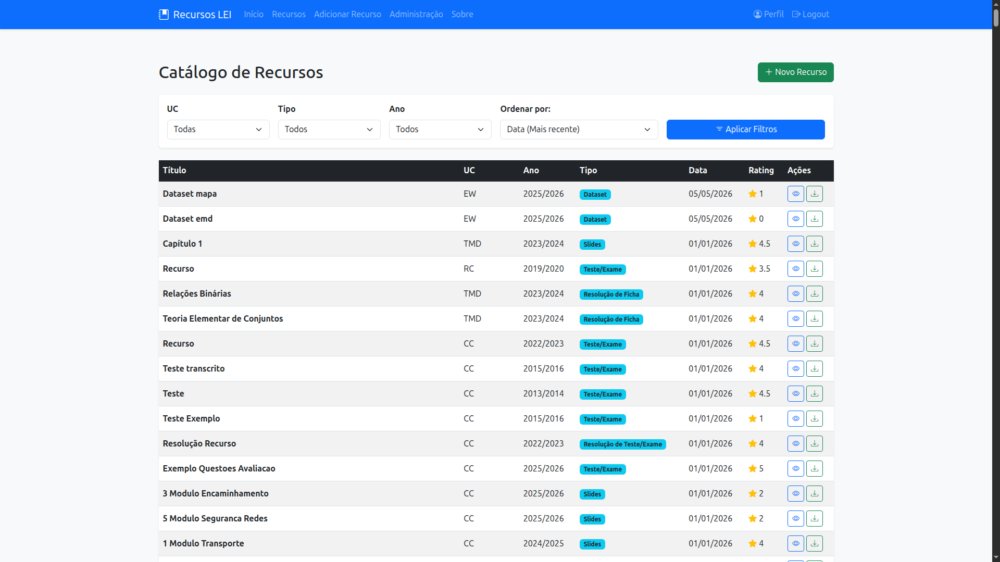

# EW (Engenharia Web) (Português)
Projeto de grupo desenvolvido no âmbito da unidade curricular de Engenharia Web. O projeto consiste no desenvolvimento de uma aplicação web com o tema `Plataforma de Gestão e Disponibilização de Recursos Educativos`. A aplicação está montada com três serviços distintos e independentes, um serviço de interface, um serviço de dados e um serviço de autenticação. O serviço de interface é o responsável por servir as páginas web e lidar com as interações do utilizador, o serviço de dados é o responsável por armazenar e gerir os dados da aplicação, e o serviço de autenticação é o responsável por gerir a autenticação dos utilizadores.

Os serviços são depois montados e orquestrados com o `Docker Compose`.

Relativamente ao tema do projeto, a aplicação foi desenvolvida com o foco de gerir e disponibilizar recursos educativos do curso de `LEI` (Licenciatura em Engenharia Informática) da `UM` (Universidade do Minho).

<p>
  
  
</p>

## Membros do grupo
* [darteescar](https://github.com/darteescar)
* [gustavocbraga](https://github.com/gustavocbraga)
* [tiagofigueiredo7](https://github.com/tiagofigueiredo7)

## Dependências
* [Node.js](https://nodejs.org/)
* [Docker](https://docs.docker.com/engine/install)

## Testar
### Correr com Docker Compose
Para correr a aplicação com Docker Compose, basta correr os seguintes comandos:

```bash
cd app/
docker compose up --build [-d]
```

Para carregar a base de dados com os recursos educativos, basta correr o seguinte comando:

```bash
node uploader.js
```

>[!WARNING]
>Para correr o comando acima sem problemas é necessário instalar o `axios` com:
>```bash
>npm install axios
>```

Para entrar na aplicação, basta aceder a `http://localhost:16001`.

Para consultar a documentação da API, basta aceder a `http://localhost:16000/api-docs`.

---

### Parar os containers
Para parar os containers, basta correr o seguinte comando:
```bash
docker compose down [-v]
```

>[!NOTE]
>Se opcionalmente usar a flag `-v`, os volumes serão removidos, o que significa que os dados armazenados na base de dados serão perdidos.

# EW (Web Engineering) (English)
Group project developed for the Web Engineering course. The project consists of the development of a web application with the theme `Platform for Management and Provision of Educational Resources`. The application is built with three distinct and independent services: an interface service, a data service, and an authentication service. The interface service is responsible for serving the web pages and handling user interactions, the data service is responsible for storing and managing the application's data, and the authentication service is responsible for managing user authentication.

The services are then built and orchestrated using `Docker Compose`.

Regarding the project theme, the application was developed with a focus on managing and providing educational resources for the `LEI` (Bachelor's in Software Engineering) course at `UM` (University of Minho).

<p>
  
  
</p>

## Group members
* [darteescar](https://github.com/darteescar)
* [gustavocbraga](https://github.com/gustavocbraga)
* [tiagofigueiredo7](https://github.com/tiagofigueiredo7)

## Dependencies
* [Node.js](https://nodejs.org/)
* [Docker](https://docs.docker.com/engine/install)

## Testing
### Run with Docker Compose
To run the application with Docker Compose, simply run the following commands:

```bash
cd app/
docker compose up --build [-d]
```

To load the database with the educational resources, simply run the following command:

```bash
node uploader.js
```

>[!WARNING]
>To run the command above without issues, it is necessary to install `axios` with:
>```bash
>npm install axios
>```

To access the application, simply go to `http://localhost:16001`.

To consult the API documentation, simply access `http://localhost:16000/api-docs`.

---

### Stop containers
To stop the containers, simply run the following command:
```bash
docker compose down [-v]
```

>[!NOTE]
>If you optionally use the `-v` flag, the volumes will be removed, which means the data stored in the database will be lost.