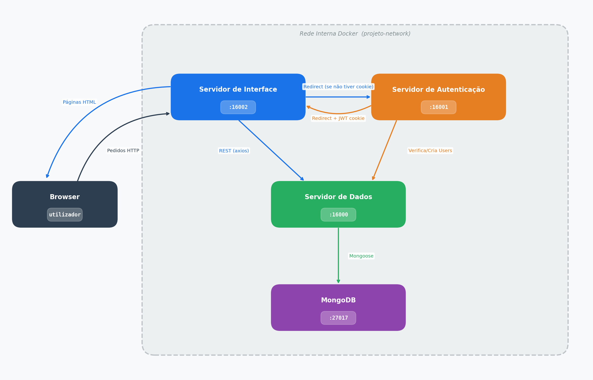

# RELATÓRIO

## Engenharia Web

### Plataforma de Recursos Educativos

---

**Grupo 8** | Engenharia Informática 2025/2026, Universidade do Minho, Braga, Portugal

**Equipa de Trabalho:**

- A106936 — [Duarte Escairo Brandão Reis Silva](https://github.com/darteescar)
- A107379 — [Gustavo Costa Braga](https://github.com/gustavocbraga)
- A106856 — [Tiago Silva Figueiredo](https://github.com/tiagofigueiredo7)

**11 Maio 2026**

---

## Índice

1. [Introdução](#1-introdução)
2. [Arquitetura do Sistema](#2-arquitetura-do-sistema)
3. [Servidor de Dados](#3-servidor-de-dados)
4. [Servidor de Autenticação](#4-servidor-de-autenticação)
5. [Servidor de Interface](#5-servidor-de-interface)
6. [Deployment com Docker](#6-deployment-com-docker)
7. [Conclusão](#7-conclusão)

---

## 1. Introdução

No âmbito da unidade curricular de Engenharia Web, foi proposto o desenvolvimento de uma plataforma web para gestão e partilha de recursos educativos entre estudantes e docentes. O sistema desenvolvido permite o upload, organização, pesquisa e avaliação de materiais académicos — como apontamentos, exames e soluções — organizados por unidade curricular e ano letivo.

O projeto foi desenvolvido em Node.js com Express, seguindo uma arquitetura de microserviços composta por três servidores independentes e uma base de dados MongoDB, todos orquestrados através de Docker Compose.

Ao longo deste relatório, descreve-se a arquitetura adotada, a lógica de funcionamento de cada servidor, o modelo de comunicação entre os componentes e o processo de deployment da aplicação.

---

## 2. Arquitetura do Sistema

O sistema é composto por quatro serviços distintos que correm no seu próprio container Docker:
<center>

| Serviço            | Portas (locais)  | Responsabilidade                          |
|--------------------|--------|-------------------------------------------|
| Servidor de Dados  | [http://localhost:16000](http://localhost:16000)  | Gestão de dados e ficheiros    |
| Servidor de Auth   | [http://localhost:16001](http://localhost:16001)  | Autenticação, registo e emissão de tokens |
| Servidor Interface | [http://localhost:16002](http://localhost:16002)  | Interface web |
| MongoDB            | [http://localhost:27017](http://localhost:27017)  | Base de dados                             |

</center>
O browser comunica exclusivamente com o servidor de interface e este, por sua vez, comunica com o servidor de autenticação para validar sessões e com o servidor de dados para todas as operações sobre recursos, utilizadores e ficheiros. Ilustrando, o fluxo de comunicação segue o seguinte modelo:

<br>



---
## 3. Base de Dados

A base de dados MongoDB, denominada `recursosEscolares`, é o primeiro serviço a arrancar pois todos os outros dependem dela. É composta por quatro coleções: `users`, `comentarios`, `recursos` e `files`.

### Inicialização

Quando o container MongoDB arranca pela primeira vez sobre uma base de dados vazia, é automaticamente executado um [script de inicialização](app/data/mongo-init/import.sh) que importa dois conjuntos de dados de exemplo: **20 utilizadores** e **1384 comentários**. Este mecanismo garante que a plataforma já tem conteúdo de base pronto a usar. Nas execuções seguintes, se o volume de dados persistente já existir, o script é ignorado.

Por outro lado, as coleções `recursos` e `files` não são populadas nesta fase, são preenchidas separadamente através de um script de importação em lote que deve ser executado manualmente uma vez após o arranque:

```bash
node uploader.js
```

Este script lê um [json](recursos.json) com os recursos, faz upload de cada ficheiro para a API de dados e cria os registos correspondentes nas coleções `recursos` e `files`. A partir daaqui, ambas as coleções também crescem sempre que um utilizador fizer upload de um novo recurso pela interface.

### Coleções

<center>

**`users`** — armazena as contas de utilizador com os seguintes campos:

| Campo | Tipo | Descrição |
|---|---|---|
| `id` | Number | Identificador numérico único, auto-incrementado |
| `nome` / `apelido` | String | Nome do utilizador |
| `email` | String | Único — usado no login |
| `password` | String | Hash bcrypt da password |
| `role` | String | `admin`, `produtor` ou `consumidor` |
| `data_criacao` | Date | Data de registo |

</center>

Os campos `nome`, `apelido` e `email` têm um índice de texto que permite pesquisa por texto livre na listagem de utilizadores.

---

<center>

**`recursos`** — armazena os metadados de cada recurso educativo:

| Campo | Tipo | Descrição |
|---|---|---|
| `id` | Number | Identificador numérico único, auto-incrementado |
| `titulo` | String | Título do recurso |
| `ano` | String | Ano letivo |
| `tipo` | String | Tipo de material (exame, apontamentos, etc.) |
| `uc` | String | Unidade curricular |
| `autor` | Number | `id` do utilizador que criou o recurso |
| `data_registo` | Date | Data de criação |
| `visibilidade` | String | `publico` ou `privado` |
| `downloads` | Number | Contador de downloads, começa em 0 |
| `visualizacoes` | Number | Incrementado a cada visita à página de detalhe |
| `media_avaliacoes` | Number | Recalculada a cada novo comentário |
| `ficheiro` | ObjectId | Referência ao documento correspondente na coleção `files` |

</center>

Os campos `titulo` e `uc` têm um índice de texto para suportar a pesquisa por texto livre (`?q=`). O campo `ficheiro` é uma referência — quando a API devolve um recurso, o Mongoose substitui automaticamente esse `ObjectId` pelo documento completo do ficheiro, incluindo nome, tamanho e tipo MIME.

---

**`comentarios`** — armazena avaliações e comentários associados a recursos:

<center>

| Campo | Tipo | Descrição |
|---|---|---|
| `id` | Number | Identificador numérico único, auto-incrementado |
| `recurso_id` | Number | `id` do recurso comentado |
| `autor` | Number | `id` do utilizador que comentou |
| `avaliacao` | Number | Valor inteiro entre 1 e 5 |
| `descricao` | String | Texto do comentário |
| `data` | Date | Data do comentário |

</center>

Sempre que um comentário é criado, a API recalcula a média de todas as avaliações do recurso e atualiza o campo `media_avaliacoes` no documento correspondente da coleção `recursos`.

---

<center>

**`files`** — armazena os metadados dos ficheiros físicos. É a única coleção com dois componentes: o registo no MongoDB e o ficheiro físico no disco.

| Campo | Tipo | Descrição |
|---|---|---|
| `originalName` | String | Nome original do ficheiro fornecido pelo utilizador |
| `storageName` | String | Nome gerado em disco (timestamp + hash aleatório + extensão) |
| `path` | String | Caminho absoluto do ficheiro em `uploads/<uc>/` |
| `mimeType` | String | Tipo do ficheiro (ex: `application/pdf`) |
| `size` | Number | Tamanho em bytes |
| `tags` | [String] | Lista de tags, tipicamente a UC do recurso |
| `category` | String | Categoria do upload (ex: `interface_upload`) |
| `createdAt` / `updatedAt` | Date | Gerados automaticamente pelo Mongoose |

</center>

O nome em disco é sempre gerado automaticamente para evitar colisões entre ficheiros com o mesmo nome e para impedir nomes maliciosos. Quando um ficheiro é eliminado, o sistema remove **ambos** — o registo na coleção `files` e o ficheiro físico do disco.

---

## 4. Servidor de Autenticação

O servidor de autenticação é responsável pelo ciclo completo de gestão de sessões, envolvendo as fases de registo, login, logout e alteração de password. A autenticação é baseada em **JWT** (JSON Web Tokens), armazenados em cookies `httpOnly` para garantir a segurança contra ataques XSS.

### Fluxo de Autenticação

Sempre que um utilizador acede à aplicação, o servidor de interface verifica a presença de um cookie de autenticação válido. Se estiver ausente ou inválido, o utilizador é redirecionado para este servidor, onde pode fazer login ou criar uma conta. O fluxo completo é o seguinte:

1. O utilizador acede ao formulário de login ou registo, servido diretamente por este servidor.
2. **Registo**: o servidor valida o formato do email e verifica se a password respeita a política definida — mínimo de 8 caracteres, incluindo pelo menos uma letra maiúscula, uma minúscula e um dígito. Se válida, a password é transformada num hash bcrypt antes de ser enviada ao servidor de dados para persistência, garantindo que nunca é armazenada em texto simples. Após registo com sucesso, o utilizador é redirecionado para o login.
3. **Login**: o servidor consulta o servidor de dados para verificar as credenciais. Se corretas, gera um **JWT** com validade de 1 hora, contendo o identificador, nome, email e role do utilizador, e guarda-o num cookie `httpOnly`. Este token permite ao servidor de interface identificar e autorizar o utilizador em todos os pedidos subsequentes sem necessidade de consultar a base de dados.
4. **Logout**: o cookie é removido e o utilizador é redirecionado para a página inicial.
5. **Alteração de password**: o utilizador pode alterar a sua password desde que forneça a password atual para confirmação de identidade. A nova password é sujeita à mesma política de segurança do registo antes de ser aceite.

---

## 5. Servidor de Interface

O servidor de interface é o único ponto de contacto direto com o browser. É responsável por servir páginas HTML geradas com templates Pug e estilos baseados na biblioteca [Bootstrap](https://getbootstrap.com/), agindo como intermediário entre o utilizador e os restantes serviços. Todas as operações de leitura e escrita de dados são feitas através de chamadas à API REST do servidor de dados, e a autenticação é validada através do servidor de autenticação.

### Roles de Utilizador

Visto que o sistema tem diferentes tipos de utilizadores, cada um com permissões distintas, foi implementado um sistema de controlo de acesso baseado em **roles**. Estes podem ser divididos em três níveis de acesso:

<center>

| Role       | Permissões                                                                            |
|------------|---------------------------------------------------------------------------------------|
| Consumidor | Consultar recursos públicos, comentar e editar o próprio perfil                       |
| Produtor   | Tudo o que um consumidor pode fazer, mais criar, editar e apagar os próprios recursos |
| Admin      | Acesso total — gere utilizadores e todos os recursos                                  |

</center>

### Controlo de Acesso

O controlo de acesso é aplicado em duas camadas complementares. A primeira atua no servidor, já que cada pedido passa por um middleware que valida o JWT presente no cookie e, caso esteja ausente ou inválido, redireciona imediatamente para o servidor de autenticação. Se o token for válido, o middleware extrai o role do utilizador e bloqueia o acesso a rotas que exijam permissões superiores às que possui.Nas rotas de edição e remoção de recursos existe ainda uma verificação adicional pois não basta ter o role adequado: o sistema confirma que o utilizador é o autor do recurso ou um administrador, impedindo que um produtor modifique conteúdo criado por outro utilizador.

A segunda camada atua nos templates, injetando o role do utilizador pelo middleware em variáveis disponíveis a todas as páginas, que utilizam-nas para mostrar ou ocultar elementos da interface. Por exemplo, a opção "Adicionar Recurso" na barra de navegação só é visível a produtores e admins, e os botões de editar e eliminar numa página de detalhe só aparecem se o utilizador tiver permissão para o fazer.

### Rotas Principais

- `/` — homepage com os dez recursos mais recentes e os dez mais visualizados, servindo de ponto de entrada para a plataforma.
- `/recursos` — catálogo com filtragem por unidade curricular, tipo de material, ano letivo e critério de ordenação. Os valores disponíveis em cada filtro são gerados dinamicamente a partir dos dados existentes na base de dados, adaptando-se automaticamente ao conteúdo real da plataforma.
- `/recursos/adicionar` — formulário de criação de um novo recurso. Quando submetido, o servidor de interface recebe o ficheiro, guarda-o temporariamente, reencaminha-o para a API de dados e elimina a cópia temporária após confirmação do upload. Acessível apenas a produtores e admins.
- `/recursos/detalhes/:id` — página de detalhe com toda a informação do recurso, comentários existentes e formulário para submeter uma nova avaliação. Cada visita incrementa automaticamente o contador de visualizações.
- `/recursos/preview/:id` e `/recursos/download/:id` — são duas formas distintas de aceder ao ficheiro de um recurso: a pré-visualização abre-o diretamente no browser, enquanto que o download força a transferência para o dispositivo do utilizador, incrementando o respetivo contador.
- `/recursos/editar/:id` e `/recursos/delete/:id` — edição e remoção de um recurso, acessíveis apenas ao autor ou a um administrador.
- `/users/perfil` e `/users/perfil/:id` — perfil do utilizador autenticado e de qualquer outro utilizador. A edição do perfil está restrita ao próprio titular da conta.
- `/admin/users` — área exclusiva para administradores com a listagem completa de utilizadores, permitindo editar o role de qualquer conta ou removê-la do sistema.

## 6. Servidor de Dados

O servidor de dados é o núcleo do sistema. Trata-se de uma REST API que expõe toda a lógica de acesso à base de dados, não servindo qualquer interface gráfica — é exclusivamente consumido pelos outros servidores através de chamadas HTTP internas. Organiza-se em quatro grupos de rotas, cada um correspondendo a uma coleção da base de dados.

Todas as rotas de listagem suportam um conjunto de parâmetros de consulta transversais que permitem controlar os resultados devolvidos:

| Parâmetro | Função |
|---|---|
| `?q=texto` | Pesquisa por texto livre nos campos indexados |
| `?campo=valor` | Filtragem direta por qualquer campo do documento |
| `?_select=a,b` | Devolve apenas os campos indicados, reduzindo o volume de dados transferido |
| `?_sort=campo&_order=asc` | Ordenação pelo campo e sentido especificados |

### Rotas

**Recursos** — operações sobre os metadados dos recursos educativos:

- `GET /api/recursos` — listagem com suporte a todos os parâmetros acima, incluindo filtragem por `tipo`, `ano`, `uc`, `autor` e `visibilidade`
- `GET /api/recursos/:id` — detalhe de um recurso, com o documento do ficheiro associado incluído na resposta
- `POST /api/recursos` — criação de um novo recurso
- `PUT /api/recursos/:id` — atualização de um recurso existente
- `DELETE /api/recursos/:id` — remoção de um recurso

**Utilizadores** — gestão de contas de utilizador:

- `GET /api/users` e `GET /api/users/:id` — listagem e detalhe
- `POST /api/users` — criação de conta, invocada pelo servidor de autenticação no registo
- `PUT /api/users/:id` — atualização de dados ou password
- `DELETE /api/users/:id` — remoção de conta
- `POST /api/login_check` — verificação de credenciais, invocada exclusivamente pelo servidor de autenticação no login

**Comentários** — avaliações e comentários associados a recursos:

- `GET /api/comentarios` — listagem com filtragem por `recurso_id` e suporte a ordenação
- `GET /api/comentarios/:id`, `POST`, `PUT`, `DELETE /api/comentarios/:id` — operações CRUD completas

**Ficheiros** — gestão dos ficheiros físicos e respetivos metadados:

Os ficheiros recebidos são organizados em subpastas por unidade curricular e guardados com um nome gerado automaticamente, como descrito na secção da base de dados. As operações disponíveis são:

- `POST /api/files/upload` — recebe o ficheiro via `multipart/form-data`, guarda-o no disco e cria o registo de metadados
- `GET /api/files/download/:id` — transmite o ficheiro em stream diretamente para o cliente
- `DELETE /api/files/:id` — remove o ficheiro do disco e o registo correspondente

### Documentação Swagger

Toda a API está documentada em formato OpenAPI 3.0, com descrição detalhada de cada endpoint, parâmetros aceites e exemplos de resposta. A interface Swagger UI está disponível em [http://localhost:16000/api-docs](http://localhost:16000/api-docs) e permite explorar e testar todos os endpoints de forma interativa.

---

## 7. Deployment com Docker

Toda a aplicação é orquestrada através de Docker Compose. Os quatro containers partilham uma rede interna, o que lhes permite comunicar pelo nome do serviço sem expor portas desnecessárias ao exterior.

### Arranque

```bash
cd app
docker-compose up --build
```

### Ordem de Inicialização

1. **MongoDB** — arranca primeiro e executa um script de inicialização que importa os dados iniciais (utilizadores e comentários) para a base de dados.
2. **Servidor de Dados** — arranca após o MongoDB estar disponível
3. **Servidor de Auth e Servidor de Interface** — arrancam após o servidor de dados

---

## 8. Conclusão

O desenvolvimento deste projeto permitiu implementar com sucesso uma plataforma de gestão de recursos educativos, explorando os principais conceitos de Engenharia Web: arquitetura de microserviços, autenticação baseada em JWT, controlo de acesso por roles, REST APIs documentadas com Swagger e uso de containers com recurso a Docker.

A separação do sistema em três servidores independentes revelou-se uma escolha adequada: o servidor de dados ficou responsável exclusivamente pela lógica de persistência, o servidor de autenticação pelo ciclo de vida das sessões, e o servidor de interface pela experiência do utilizador. Esta divisão simplificou o desenvolvimento e facilita a manutenção futura de cada componente de forma independente.

Como trabalho futuro, poderiam ser exploradas melhorias como a paginação de resultados na interface, notificações em tempo real com WebSockets, e a possibilidade de os utilizadores organizarem recursos em coleções pessoais.
